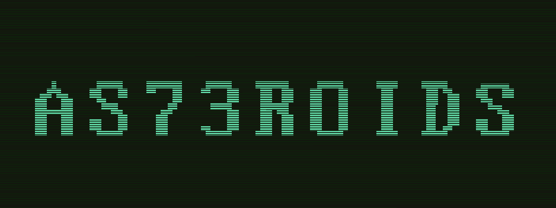
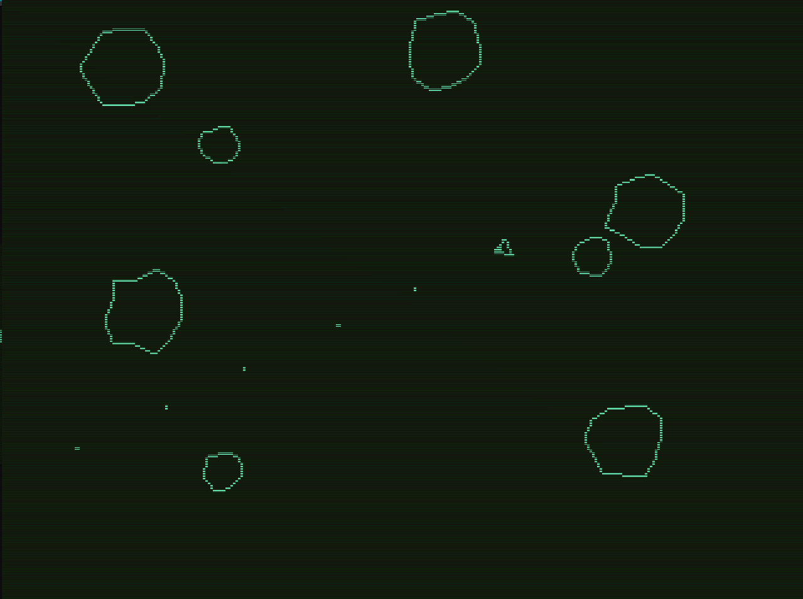
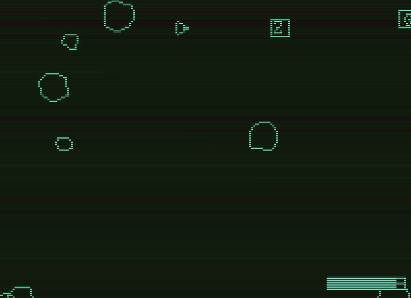
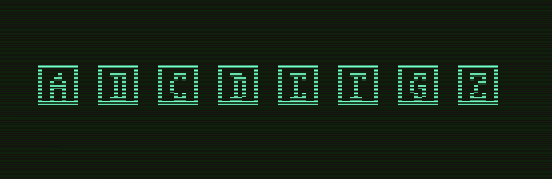

## AS73ROIDS

### Description

As73roids is a re imagination of the old classic, with a 70's feel,
with tributes to some of the games I like the most.
How long will you survive?

### Features
 - Basics

 - Gravity: When thrusting ship will slowly start to gain speed. But wont stop. In order to try to stop you need to face the opossite direction and thurst.

 - Energy: you have a limited amount of energy, shown on the bottom right. Energy will deplete as you shoot. The more powerful your shots, the more energy will take. Energy will slowly regenerate over time, and a little bit faster if you generate kinematic energy by Thrusting.
    

 - Death: Don't crash on an asteroid, or you will die
    
 
 - Power Ups:

 - [A] Speed Up: increases speed. Up to 5 increments.
 - [B] Rotation Up: increases rotation speed Up. to 5 increments.
 - [D] Triple Shot: ship will fire on every triangle direction.
 - [E] Cone Shot: ship will fire 3 bullets on a cone shape forward
 - [F] Ricochet: bullets that hit an asteroid will ricochet to a random direction. Additional pickups will make ricochet bullets to ricochet again. Up to 3 jumps
 - [G] Back Shot: ship will shoot backwards
 - [Z] Apocalipsis: kills all asteroids in space 

### Controls

Keyboard:
 - W/Up   : Thrust
 - A/Left : Rotate Left
 - D/Right: Rotate Right

### Screenshots

### Developers

 - @mglgmz

### License

This game sources are licensed under an unmodified zlib/libpng license, which is an OSI-certified, BSD-like license that allows static linking with closed source software. Check [LICENSE](LICENSE) for further details.

*Copyright (c) 2024 @mglgmz 
